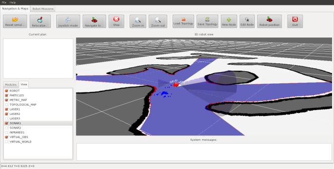

About OpenMORA 
==========

**Open Mobile Robot Arquitecture (OpenMORA)** is a [MOOS](http://www.robots.ox.ac.uk/~mobile/MOOS) and [MRPT](http://www.mrpt.org/)-based distributed architecture for mobile robots. It provides off-the-shelf modules for common robotics platforms and sensors, dataset logging, MonteCarlo Localization, reactive navigation, etc.

Where to start
------

Write me!

Screenshots 
------

Write me!

Authors
------

OpenMORA is maintained by the [MAPIR lab](http://mapir.isa.uma.es/mapirwebsite/) (University of Málaga), the Mechanical Engineering Lab (University of Almería) and individual contributors. Refer to the individual [repositories](https://github.com/OpenMORA) for details.

