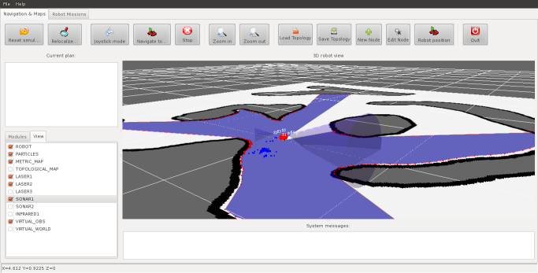

About OpenMORA 
===============

.. raw:: html

    

.. image:: _static/imgs/openmora_small.jpg

.. raw:: html

    

**Open Mobile Robot Arquitecture (OpenMORA)** is a lightweight distributed 
architecture for mobile robots based on `MOOS <http://www.robots.ox.ac.uk/~mobile/MOOS>`_ 
and `MRPT <http://www.mrpt.org/>`_. 
It provides off-the-shelf modules for common robotics platforms and sensors, dataset logging, MonteCarlo Localization, reactive navigation, etc.

Where to start
------

.. Contents:

.. toctree::
   :maxdepth: 2

   install
   tutorials/quickstart

Screenshots 
------

Write me!

Authors
------

OpenMORA is maintained by the `MAPIR lab <http://mapir.isa.uma.es/mapirwebsite/>`_ 
(University of Málaga), the Mechanical Engineering Lab (University of Almería) 
and individual contributors. 
Refer to the individual `repositories <https://github.com/OpenMORA>`_ 
for details.

